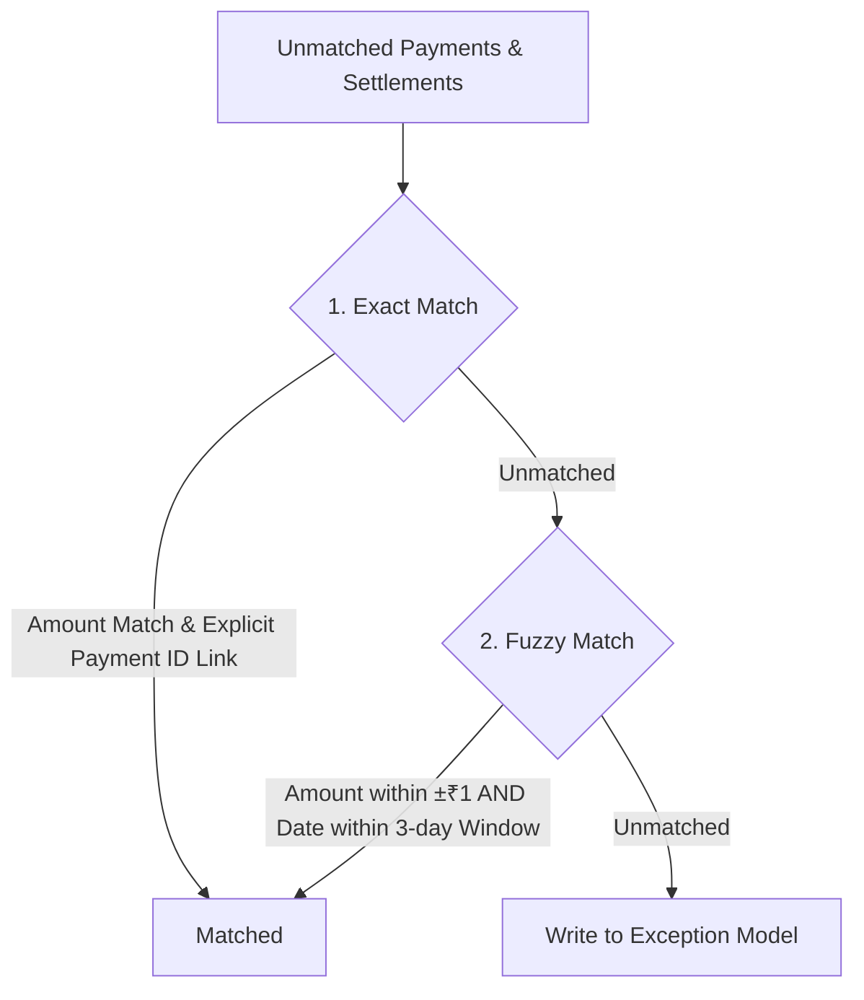

# AI Finance Controller - Settlement Reconciliation & Q&A Platform

A deterministic, high-accuracy settlement reconciliation engine and thin AI-backed natural-language Q&A interface designed for financial controllers. This application was built for the **AI Finance Controller Hackathon**.

## Project Architecture

The system is split into three main components:
1. **Deterministic Reconciliation Engine (Node.js & Express):** Standardized, auditable pipeline that matches payment transactions against settlement/bank entries. No LLMs are used here, ensuring complete audit trails.
2. **LLM Q&A Layer (Google Gemini 2.0 Flash):** A thin agentic layer using function-calling (Tool Use) to translate natural-language questions into structured MongoDB queries, then phrasing plain-language answers.
3. **Controller UI (React & Vite):** A clean dashboard allowing users to trigger reconciliation, view exceptions categorized by reason code, and query transaction state using natural language.

---

## ⚙️ Reconciliation Matching Logic

Reconciliation is executed in two deterministic passes to minimize errors and identify discrepancies:



### 1. Exact Match (Pass 1)
- Checks if the bank settlement explicitly references a payment ID via `linkedPaymentId`.
- Both the payment and settlement must have the **exact same currency amount**.
- Successful matches are marked and skipped in subsequent passes.

### 2. Fuzzy Match (Pass 2)
- Inspects remaining unmatched payments and settlements.
- Matches are established if the settlement amount is within **±₹1 tolerance** of the payment amount **AND** the settlement timestamp `settledOn` falls within a **3-day window** of the payment `timestamp`.

### 3. Exception Resolution (Pass 3)
Any remaining items on either side are marked unmatched and recorded as `Exception` entries with one of the following **Reason Codes**:

| Reason Code | Applied When | Example Scenario |
| :--- | :--- | :--- |
| **`AMOUNT_MISMATCH`** | A payment is explicitly linked to a settlement, but the settled amount differs by more than ±₹1 tolerance. | Payment is ₹1,000, bank settles ₹995. |
| **`DATE_OUT_OF_WINDOW`** | A payment is explicitly linked to a settlement and amounts match, but the bank settled more than 3 days later. | Payment is made on Monday, settled next week Tuesday. |
| **`DUPLICATE_SETTLEMENT`** | Multiple settlement entries are linked to the same payment ID. | Bank processes a payment twice in error. |
| **`NO_COUNTERPART`** | A payment has no matching bank settlement, or a bank settlement has no matching payment counterpart. | Charge failed or was settled outside current records. |

---

## 🤖 AI Q&A Layer (Function-Calling Schema)

The AI assistant parses natural-language queries into structured MongoDB queries using the Gemini API's tool execution framework:

1. **NL translation:** Translates queries like *"why didn't payment pay_12 settle?"* or *"show me all exceptions for amount mismatches over ₹500"* into database filter parameters.
2. **Structured Query:** Sends `mongo_query` tool payload:
   ```json
   {
     "collection": "Exception",
     "filter": { "paymentId": "pay_12" }
   }
   ```
3. **Plain-English Answer:** Receives structured documents back from MongoDB, compiles them, and produces a final summary for the user.

---

## 🚀 Setup & Execution

### Prerequisites
- [Node.js](https://nodejs.org/) (v16+)
- [MongoDB](https://www.mongodb.com/) (running locally on port `27017`)

### 1. Backend Setup
1. Open the `/server` directory:
   ```bash
   cd server
   ```
2. Create or configure your `.env` file:
   ```env
   MONGODB_URI=mongodb://127.0.0.1:27017/settlement_demo
   GEMINI_API_KEY=your_gemini_api_key
   MATCH_WINDOW_DAYS=3
   AMOUNT_TOLERANCE=1.0
   PORT=5000
   ```
3. Seed the database with synthetic payments and settlements (includes exact matches, duplicate entries, date-out-of-window errors, and counterpart omissions):
   ```bash
   npm run seed
   ```
4. Start the backend development server:
   ```bash
   npm run dev
   ```

### 2. Frontend Setup
1. Open the `/client` directory:
   ```bash
   cd client
   ```
2. Install frontend dependencies:
   ```bash
   npm install
   ```
3. Start the Vite React development server:
   ```bash
   npm run dev
   ```
4. Open your browser and navigate to `http://localhost:3000/`.

---

## 📸 Demo Walkthrough

1. **Run Reconciliation:** Click the **Run Batch Reconciliation** button in the header. The system updates the live statistics container showing your current match rate, total payments, and total exceptions found.
2. **Inspect Exceptions:** Use the exceptions table search and filter controls to isolate different categories (e.g. filter by `AMOUNT_MISMATCH` or search for a specific payment ID).
3. **AI Financial Assistant:** Use the chat panel suggestions or ask custom questions:
   - *"What is our current match rate?"*
   - *"Why did payment pay_12 not settle?"*
   - *"List all amount mismatches"*
   - *"List exceptions where details mention payment"*
